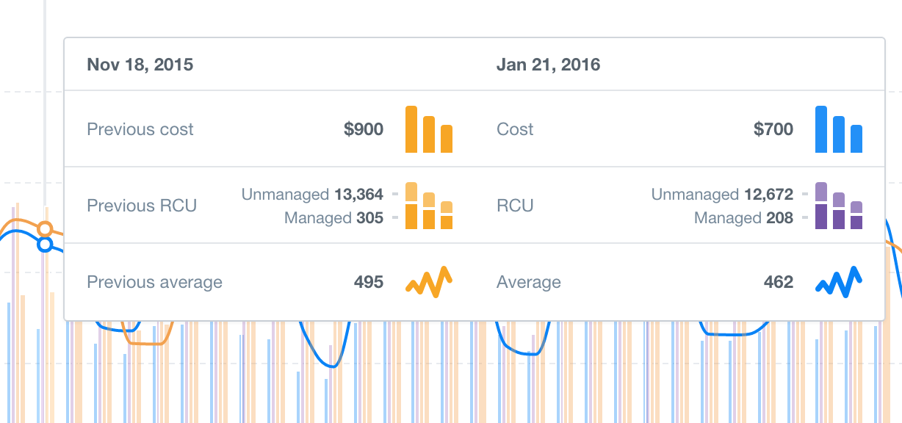

# Charkit

Chartkit provides deep integration between the Angular framework and the wonderful
Highcharts library.

## The Problem

When building a serious data visualization app, you often end up with a Highcharts
configuration object that runs several hundred or perhaps thousands lines long.
Since this is a single object, it is not particularly modular. Similarly, Angular
uses directives for its view layer, which are also configuration objects. Hence
you end up with a long object in a link function in another long object.

In Chartkit, charts are their own DI object. So instead of writing something like this:

```javascript
angular.module('MyApp').directive('overviewChart', function() {
  return {
    restrict: 'E',
    scope: {
      data: '='
    },
    link: function(scope, element) {
      var chart = new Highcharts.Chart({
        chart: {
          renderTo: element[0]
        },
        title: {
          text: 'Monthly Average Temperature',
        },
        xAxis: {
          categories: ['Jan', 'Feb', 'Mar', 'Apr', 'May', 'Jun', 'Jul', 'Aug', 'Sep', 'Oct', 'Nov', 'Dec']
        },
        yAxis: {
          title: {
            text: 'Temperature (°C)'
          },
          plotLines: [{
            value: 0,
            width: 1,
            color: '#808080'
          }]
        },
        legend: {
          layout: 'vertical',
          align: 'right',
          verticalAlign: 'middle',
          borderWidth: 0
        }
      });
      // code to initialize the data
    }
  };
});
```

You can simplify to this:

```javascript
angular.module('MyApp').chart('overview', function() {
  return {
    title: {
      text: 'Monthly Average Temperature',
    },
    xAxis: {
      categories: ['Jan', 'Feb', 'Mar', 'Apr', 'May', 'Jun', 'Jul', 'Aug', 'Sep', 'Oct', 'Nov', 'Dec']
    },
    yAxis: {
      title: {
        text: 'Temperature (°C)'
      },
      plotLines: [{
        value: 0,
        width: 1,
        color: '#808080'
      }]
    },
    legend: {
      layout: 'vertical',
      align: 'right',
      verticalAlign: 'middle',
      borderWidth: 0
    }
  };
});
```

Which will achieve the same result.

## Native HTML rendering

Highcharts support HTML in tooltips and a bunch of other places. However, the templating
system seems designed for very simple HTML formatting. Building real world data visualization
software, you find yourself building tooltips like this:



For this rendering tooltips via string concatenation becomes quickly annoying. Finally it
usually involves slightly different templating language then you use in the rest of the
app (we used Lo-dash's `_.template` function before Charkit). This becomes quickly annoying.

Chartkit solves this problem by allowing you to pass an object anywhere where Highcharts
supports a `formatter` function (i.e. tooltips, dataLabels, axis labels). This object
can have either a `template` or `templateUrl` key, which is the Angular templating
system. It runs natively (i.e. doesn't try to extract HTML strings and parse them
again) and supports the whole Angular system, including directives, controllers, etc.

So instead of doing something like:

```javascript
{
  tooltip: {
    useHTML: true,
    formatter: function() {
      return _.template('<div class="tooltip">' +
        '<% _.each(points, function(point) { %>' +
          '<span class="point-label <%=_.dasherize(point.series.name) %>' +
            '<%= point.series.name %">' +
            '<span class="value"><%= point.y %></span>' +
          '</span>' +
        '})' +
        '</div>')(this);
    }
  }
}
```

You can now do:

```javascript
{
  tooltip: {
    useHTML: true,
    formatter: {
      templateUrl: 'views/overview/chart_tooltip.html'
    }
  }
}
```
```html
<div class="tooltip">
  <span ng-repeat="point in points" class="point-label" ng-class="point.series.name | dasherize">
    {{point.series.name}} <span class="value">{{ point.y}}</span>
  </span>
</div>
```

Which is much nicer. This allows you to also abstract complex logic into its own directive.

**Note:** Currently this requires you to set the `useHTML` option to true. Chartkit will
throw if this is not the case. We may support SVG rendering in the future, but currently
you will still need to use the Highcharts native API for that.

## Directive API

The `chart` method accepts an injectable factory function, that should return a
*chart definition object* (this is exactly like directives). The chart definition
object is passed to the Highcharts constructor (this means you should still be able
to copy & paste snippets of Highcharts config into your chart factories). However,
the chart definition object accepts some extra keys. We've mentioned the special
treatment of `formatter` keys. In addition the object can contain the keys: `require`,
`link` and `scope`, which are the same as the Angular directive API.

The `scope` defaults to `{data: '='}` and serves as a standard way for charts to
receive data from controllers.

The `link` function will be called with the regular parameters. The final controllers
parameter will contain a reference to the Highcharts object containing your chart,
which will have been already initialized by the time the `link` function runs. This
will allow you to do any custom rendering.

### transform

If you have `data` as a scope variable (i.e. you either keep the defaults or add it
yourself), you can also pass a `transform` key in the chart definition object. This
is a convenience high-level API, since often chart directive need to wait for API requests to
complete before they render their data. The `transform` function will be called with
the contents of the `data` scope variable whenever that changes and is considered
non-empty. The `transform(data, chart, scope)` function is called and should return
an array of series objects, which should contain an `id` property and some data.

These series objects are watched and the chart is automatically updated as appropriate
(i.e. missing series will be deleted, new ones added, and changed ones will be updated).

If you have a [`loading`](http://api.highcharts.com/highcharts#loading) key in
your config, Chartkit will also automatically call
[`Chart.showLoading`](http://api.highcharts.com/highcharts#Chart.showLoading) and
[`Chart.hideLoading`](http://api.highcharts.com/highcharts#Chart.hideLoading) for
you.

## User Input

In Angular user input is handled by directives and scope binding. Highcharts on the
other hand use `events` objects. We wrap the `events` objects for you passing an additional
parameter at the end which is the `scope` object. We will also handle triggering a
digest for you.

```javascript
{
  events: {
    click: function(event, scope) {
      scope.selected = event.point.category;
    }
  }
}
```

## Set globals

Often you have a shared style. With Chartkit you can do something like this:

```javascript
angular.module('MyApp').config(function(Highcharts) {
  Highcharts.setOptions({
    colors: ['#058DC7', '#50B432', '#ED561B', '#DDDF00', '#24CBE5', '#64E572', '#FF9655', '#FFF263', '#6AF9C4'],
    chart: {
      backgroundColor: {
        linearGradient: [0, 0, 500, 500],
        stops: [
          [0, 'rgb(255, 255, 255)'],
          [1, 'rgb(240, 240, 255)']
        ]
      },
      borderWidth: 2,
      plotBackgroundColor: 'rgba(255, 255, 255, .9)',
      plotShadow: true,
      plotBorderWidth: 1
    },
    title: {
      style: {
        color: '#000',
        font: 'bold 16px "Trebuchet MS", Verdana, sans-serif'
      }
    },
    subtitle: {
      style: {
        color: '#666666',
        font: 'bold 12px "Trebuchet MS", Verdana, sans-serif'
      }
    },
    xAxis: {
      gridLineWidth: 1,
      lineColor: '#000',
      tickColor: '#000',
      labels: {
        style: {
          color: '#000',
          font: '11px Trebuchet MS, Verdana, sans-serif'
        }
      },
      title: {
        style: {
          color: '#333',
          fontWeight: 'bold',
          fontSize: '12px',
          fontFamily: 'Trebuchet MS, Verdana, sans-serif'

        }
      }
    },
    yAxis: {
      alternateGridColor: null,
      minorTickInterval: 'auto',
      lineColor: '#000',
      lineWidth: 1,
      tickWidth: 1,
      tickColor: '#000',
      labels: {
        style: {
          color: '#000',
          font: '11px Trebuchet MS, Verdana, sans-serif'
        }
      },
      title: {
        style: {
          color: '#333',
          fontWeight: 'bold',
          fontSize: '12px',
          fontFamily: 'Trebuchet MS, Verdana, sans-serif'
        }
      }
    },
    legend: {
      itemStyle: {
        font: '9pt Trebuchet MS, Verdana, sans-serif',
        color: 'black'

      },
      itemHoverStyle: {
        color: '#039'
      },
      itemHiddenStyle: {
        color: 'gray'
      }
    },
    credits: false,
    labels: {
      style: {
        color: '#99b'
      }
    }
  });
});
```

## Maintainers

Maintained by Jakub Hampl (@gampleman) - http://gampleman.eu

## License

(c) RightScale, inc. 2016

MIT License

Permission is hereby granted, free of charge, to any person obtaining a copy of this software and associated documentation files (the "Software"), to deal in the Software without restriction, including without limitation the rights to use, copy, modify, merge, publish, distribute, sublicense, and/or sell copies of the Software, and to permit persons to whom the Software is furnished to do so, subject to the following conditions:

The above copyright notice and this permission notice shall be included in all copies or substantial portions of the Software.

THE SOFTWARE IS PROVIDED "AS IS", WITHOUT WARRANTY OF ANY KIND, EXPRESS OR IMPLIED, INCLUDING BUT NOT LIMITED TO THE WARRANTIES OF MERCHANTABILITY, FITNESS FOR A PARTICULAR PURPOSE AND NONINFRINGEMENT. IN NO EVENT SHALL THE AUTHORS OR COPYRIGHT HOLDERS BE LIABLE FOR ANY CLAIM, DAMAGES OR OTHER LIABILITY, WHETHER IN AN ACTION OF CONTRACT, TORT OR OTHERWISE, ARISING FROM, OUT OF OR IN CONNECTION WITH THE SOFTWARE OR THE USE OR OTHER DEALINGS IN THE SOFTWARE.
